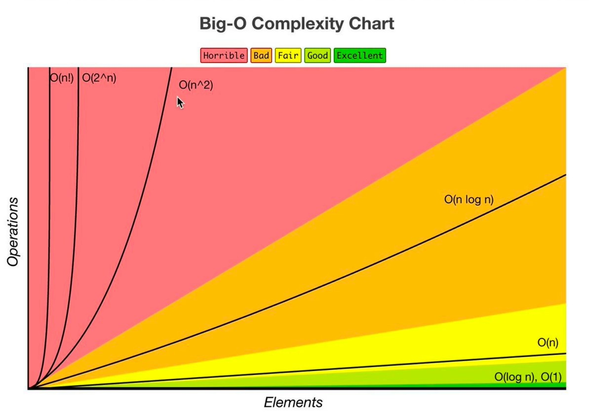

# Big O — Concepts

## What is Good Code?

Two things. That's it.

**1. Readable** — someone else (or future you) can understand it  
**2. Scalable** — performs well as input grows → this is where Big O comes in

### The 3 Pillars

| Pillar | Measures | Tool |
|--------|----------|------|
| Readable | Clarity, maintainability | Code review, naming |
| Speed | Time Complexity | Big O — operations count |
| Memory | Space Complexity | Big O — memory used |

> "Premature optimization is the root of all evil." — Knuth  
> First make it work. Then make it readable. Then — only if needed — make it fast.

---

## What It Actually Measures
Big O = **rate of growth** of time/space as input `n` grows.  
Not actual speed. Not milliseconds. Growth behavior.

> Two O(n) algos can differ 10x in real time. Big O ignores constants.

---

## The Hierarchy (Know This Cold)

```
O(1) < O(log n) < O(n) < O(n log n) < O(n²) < O(2ⁿ) < O(n!)
```




| Complexity   | Name         | Example                          | n=1000 ops (approx) |
|--------------|--------------|----------------------------------|----------------------|
| O(1)         | Constant     | HashMap lookup, array index      | 1                    |
| O(log n)     | Logarithmic  | Binary search, BST ops           | ~10                  |
| O(n)         | Linear       | Single loop, linear scan         | 1,000                |
| O(n log n)   | Linearithmic | Merge sort, heap sort            | ~10,000              |
| O(n²)        | Quadratic    | Nested loops, bubble sort        | 1,000,000            |
| O(2ⁿ)        | Exponential  | Recursive subsets, backtracking  | 2^1000 💀            |
| O(n!)        | Factorial    | Permutations                     | 🔥                   |

### Quality Rating (from the chart)

| Complexity | Rating    | Color  | Real-world feel                        |
|------------|-----------|--------|----------------------------------------|
| O(1)       | Excellent | 🟢     | Instant regardless of input size       |
| O(log n)   | Excellent | 🟢     | Barely noticeable even at n=1M         |
| O(n)       | Good      | 🟡     | Acceptable — grows linearly            |
| O(n log n) | Fair      | 🟠     | OK for sorting, avoid in tight loops   |
| O(n²)      | Bad       | 🔴     | Breaks at n=10k+. Nested loop smell.   |
| O(2ⁿ)      | Horrible  | 🔴     | Only usable at tiny n (<30)            |
| O(n!)      | Horrible  | 🔴     | Never acceptable in production         |

---

## Calculating Big O — Real Examples

### Example 1 — Log All Pairs of Array
```js
const arr = [1, 2, 3, 4, 5, 6];

function logAllPairs(arr) {
  for (let i = 0; i < arr.length; i++) {       // O(n)
    for (let j = 0; j < arr.length; j++) {     // O(n)
      console.log(arr[i], arr[j]);
    }
  }
}
// Nested loops on SAME input → O(n × n) = O(n²)
```
Output for `[1,2,3]`: `(1,1) (1,2) (1,3) (2,1) (2,2)...` → n² pairs

---

### Example 2 — O(1): String Length
```js
'asdfasdfdsafasdfasdfcdsfcasfd'.length  // O(1)
```
JS engine stores `.length` as a property — no counting at runtime.  
Same for `arr.length` — it's a stored value, not a computation.

---

### Example 3 — O(n): Single Loops
These are all O(n) — doesn't matter which loop syntax you use:
```js
// for loop
for (let i = 0; i < arr.length; i++) { ... }

// forEach
arr.forEach(item => { ... })

// for...of
for (const item of arr) { ... }
```
All iterate once over n elements. Syntax changes, complexity doesn't.

---

### Example 4 — Step-by-step calculation
```js
function doStuff(arr) {
  // Step 1 — O(n)
  arr.forEach(item => console.log(item));

  // Step 2 — O(n)
  arr.forEach(item => console.log(item));

  // Step 3 — O(1)
  console.log('done');
}
// Total: O(n) + O(n) + O(1)
// Simplify: O(2n + 1) → O(n)
```

---

### Example 5 — O(n²): Nested on same input
```js
function logAllPairs(arr) {
  for (let i of arr)         // O(n)
    for (let j of arr)       // O(n)  ← same arr
      console.log(i, j);
}
// O(n × n) = O(n²)
```

---

### Example 6 — O(a × b): Nested on different inputs
```js
function logPairs(arrA, arrB) {
  for (let i of arrA)        // O(a)
    for (let j of arrB)      // O(b)  ← different input!
      console.log(i, j);
}
// NOT O(n²) — correct answer: O(a × b)
// If arrA is 5 items and arrB is 1000 items — very different from O(n²)
```

---

### Example 7 — O(log n): Binary Search intuition
```js
// Every step, input is cut in half
// n=8 → 4 → 2 → 1  (3 steps = log₂8)
// n=1000 → ~10 steps
// n=1M  → ~20 steps

function binarySearch(arr, target) {
  let lo = 0, hi = arr.length - 1;
  while (lo <= hi) {
    const mid = Math.floor((lo + hi) / 2);    // halving here
    if (arr[mid] === target) return mid;
    else if (arr[mid] < target) lo = mid + 1;
    else hi = mid - 1;
  }
  return -1;
}
// O(log n) — each iteration eliminates half the remaining elements
```

---

### Example 8 — O(2ⁿ): Recursive Fibonacci
```js
function fib(n) {
  if (n <= 1) return n;
  return fib(n - 1) + fib(n - 2);  // 2 calls each time
}
// fib(6) → fib(5) + fib(4)
//        → fib(4)+fib(3) + fib(3)+fib(2)  ...doubles each level
// Total calls ≈ 2^n
// fib(30) = ~1 billion ops. fib(50) = unusable.
```

---

### 1. Drop Constants
```
O(2n) → O(n)
O(500) → O(1)
```

### 2. Drop Non-Dominant Terms
```
O(n² + n) → O(n²)
O(n + log n) → O(n)
```

### 3. Different Inputs = Different Variables
```js
// WRONG to call this O(n²)
function twoArrays(a, b) {
  for (let x of a)        // O(a)
    for (let y of b)      // O(b)
      console.log(x, y);
}
// Correct: O(a * b)
```

### 4. Sequential Steps → Add
```js
doA(n);  // O(n)
doB(n);  // O(n)
// Total: O(n) + O(n) = O(n)  ← still O(n)
```

### 5. Nested Steps → Multiply
```js
for (let i of n)      // O(n)
  for (let j of n)    // O(n)
// Total: O(n²)
```

---

## Space Complexity

### Where Memory Lives

| Location | What goes there | Example |
|----------|----------------|---------|
| **Heap** | Variables, objects, data structures you allocate | `new Array(n)`, `new Map()` |
| **Stack** | Function call frames, local vars, return addresses | Recursion, nested calls |

Counts: **stack frames + heap allocations** you create.  
Does NOT count: input itself (unless problem says so).

### What Causes Space Complexity?

```
1. Variables         → let x = 5         (O(1) — single value)
2. Data structures   → new Map(), []      (O(n) — grows with input)
3. Function calls    → recursion stack    (O(depth))
4. Allocations       → .map(), .filter()  (O(n) — returns new array)
```

### JS-Specific Notes

```js
'asdfasdfdsafasdfasdfcdsfcasfd'.length  // O(1) — length is a stored property, not computed

[1,2,3].forEach(...)   // O(1) extra space — no new array returned
[1,2,3].map(...)       // O(n) — creates new array
[1,2,3].filter(...)    // O(n) — creates new array (up to n elements)
[1,2,3].reduce(...)    // O(1) — accumulates into single value
```

### Examples

```js
// O(1) space — no new structure grows with input
function sum(arr) {
  let total = 0;          // one variable, always
  for (let n of arr) total += n;
  return total;
}

// O(n) space — new array same size as input
function double(arr) {
  return arr.map(x => x * 2);
}

// O(n) space — call stack grows n deep
function factorial(n) {
  if (n <= 1) return 1;
  return n * factorial(n - 1);  // n frames on stack simultaneously
}

// O(log n) space — stack grows log n deep (input halves each call)
function binarySearch(arr, target, lo = 0, hi = arr.length - 1) {
  if (lo > hi) return -1;
  const mid = Math.floor((lo + hi) / 2);
  if (arr[mid] === target) return mid;
  if (arr[mid] < target) return binarySearch(arr, target, mid + 1, hi);
  return binarySearch(arr, target, lo, mid - 1);
}
```

---

## 3 Cases — Which One Matters?

| Case    | Meaning                        | What We Usually Report |
|---------|--------------------------------|------------------------|
| Best    | Most favorable input           | Rarely useful          |
| Average | Expected real-world input      | Sometimes              |
| Worst   | Most unfavorable input         | **Always report this** |

> Exception: QuickSort — worst O(n²), average O(n log n). Both worth knowing.

---

## DS Operations Cheatsheet

### Array
| Op           | Time   | Note                          |
|--------------|--------|-------------------------------|
| Access [i]   | O(1)   |                               |
| Search       | O(n)   | unsorted                      |
| Insert end   | O(1)*  | amortized (resize happens)    |
| Insert mid   | O(n)   | shift required                |
| Delete end   | O(1)   |                               |
| Delete mid   | O(n)   | shift required                |

### HashMap (JS Object / Map)
| Op      | Time   | Note                              |
|---------|--------|-----------------------------------|
| Get     | O(1)   | amortized; O(n) worst (collision) |
| Set     | O(1)   | amortized                         |
| Delete  | O(1)   | amortized                         |
| Has     | O(1)   | amortized                         |

> In interviews: always assume O(1) for HashMap unless asked otherwise.

### Stack / Queue (array-based)
| Op           | Time |
|--------------|------|
| push / pop   | O(1) |
| peek         | O(1) |
| search       | O(n) |

### Linked List
| Op            | Time | Note                    |
|---------------|------|-------------------------|
| Access [i]    | O(n) | no random access        |
| Insert (head) | O(1) |                         |
| Insert (tail) | O(1) | if tail pointer exists  |
| Insert (mid)  | O(n) | find + insert           |
| Delete (head) | O(1) |                         |
| Search        | O(n) |                         |

### Binary Search Tree (balanced)
| Op     | Time     | Note               |
|--------|----------|--------------------|
| Search | O(log n) |                    |
| Insert | O(log n) |                    |
| Delete | O(log n) |                    |

> Unbalanced BST degrades to O(n). Always say "balanced" in interviews.

### Heap / Priority Queue
| Op        | Time     |
|-----------|----------|
| Insert    | O(log n) |
| Remove    | O(log n) |
| Peek min  | O(1)     |
| Heapify   | O(n)     |

### Sorting Algorithms
| Algorithm    | Best       | Average    | Worst      | Space    |
|--------------|------------|------------|------------|----------|
| Bubble       | O(n)       | O(n²)      | O(n²)      | O(1)     |
| Selection    | O(n²)      | O(n²)      | O(n²)      | O(1)     |
| Insertion    | O(n)       | O(n²)      | O(n²)      | O(1)     |
| Merge Sort   | O(n log n) | O(n log n) | O(n log n) | O(n)     |
| Quick Sort   | O(n log n) | O(n log n) | O(n²)      | O(log n) |
| Heap Sort    | O(n log n) | O(n log n) | O(n log n) | O(1)     |
| Counting     | O(n + k)   | O(n + k)   | O(n + k)   | O(k)     |
| Radix        | O(nk)      | O(nk)      | O(nk)      | O(n + k) |

> JS `Array.sort()` — V8 uses TimSort → O(n log n) average.

---

## Recursive Complexity — Master Theorem (Simplified)

For recursion like:  
```
T(n) = a * T(n/b) + O(n^d)
```

| Condition     | Complexity   | Example           |
|---------------|--------------|-------------------|
| d > log_b(a)  | O(n^d)       |                   |
| d = log_b(a)  | O(n^d log n) | Merge Sort        |
| d < log_b(a)  | O(n^log_b a) | Binary Search     |

**Simpler heuristic for interviews:**
- One recursive call, half input → O(log n)
- One call, full input → O(n)
- Two calls, half input → O(n log n) ... often
- Two calls, full input → O(2ⁿ)

---

## Amortized Analysis

> Single operation can be expensive, but **averaged over many ops** it's cheap.

Classic: **Dynamic Array resizing**
- 99 pushes: O(1) each
- 100th push: triggers resize → O(n) copy
- Amortized over 100 ops: still O(1) per push

JS Array `push()` is **O(1) amortized**.

---

## Rule Book — 4 Rules (Memorize These)

> These 4 rules are how you simplify any complexity expression in an interview.

---

### Rule 1: Worst Case

Always report the **worst case** unless told otherwise.

```js
function findNemo(arr) {
  for (let i = 0; i < arr.length; i++) {
    if (arr[i] === 'nemo') {
      console.log('Found nemo!');
      break;
    }
  }
}

findNemo(['dory', 'bruce', 'nemo']);  // finds at index 2 — lucky
findNemo(['nemo']);                   // finds immediately — best case O(1)
findNemo(['a', 'b', 'c', 'nemo']);   // nemo is last — worst case O(n)
```

**Always say O(n).** Never say "it's O(1) because nemo might be first."  
Worst case = nemo is the last element, or not there at all.

---

### Rule 2: Remove Constants

Drop multipliers and additive constants — they don't matter at scale.

```js
function printItems(arr) {
  // First loop — O(n)
  arr.forEach(item => console.log(item));

  // Useless middle work — O(1)
  let middle = Math.floor(arr.length / 2);
  console.log('Halfway:', middle);

  // Second loop — O(n)
  arr.forEach(item => console.log(item));
}
// Raw: O(n + 1 + n) = O(2n + 1)
// Remove constants: O(n)
```

More examples:
```
O(2n)      → O(n)
O(n/2)     → O(n)
O(500)     → O(1)
O(3n² + n) → O(n²)   ← drop the 3, drop the +n
```

**Why?** At n = 1,000,000 the constant is irrelevant. Big O is about growth shape, not exact count.

---

### Rule 3: Different Terms for Inputs

If your function takes **two different inputs**, they get **two different variables**.

```js
// WRONG — calling this O(n²)
function logBoxes(boxes1, boxes2) {
  boxes1.forEach(b => console.log(b));   // O(a)
  boxes2.forEach(b => console.log(b));   // O(b)
}
// Correct: O(a + b)
// If loops were NESTED: O(a × b)

// Common mistake:
function nested(arrA, arrB) {
  for (let a of arrA)       // O(a)
    for (let b of arrB)     // O(b)
      console.log(a, b);
}
// This is O(a × b) NOT O(n²)
// n² only when SAME array is nested: O(n × n)
```

---

### Rule 4: Drop Non-Dominants

When you have multiple terms, keep only the fastest-growing one.

```js
function printAllThenPairs(arr) {
  // O(n) — linear scan
  arr.forEach(item => console.log(item));

  // O(n²) — nested pairs
  for (let i of arr)
    for (let j of arr)
      console.log(i, j);
}
// Total: O(n + n²)
// n² dominates → drop n → O(n²)
```

More examples:
```
O(n² + n)         → O(n²)
O(n + log n)      → O(n)
O(2^n + n² + n)   → O(2^n)
O(n! + 2^n + n²)  → O(n!)
```

**Why?** As n → ∞, the dominant term completely overwhelms the rest.  
At n=1000: n²=1,000,000 vs n=1000. The n is noise.

---

### Rule Book Summary

| Rule | What to do | Example |
|------|-----------|---------|
| 1. Worst Case | Always assume worst input | O(n) not O(1) for linear search |
| 2. Remove Constants | Drop multipliers & additive constants | O(2n + 5) → O(n) |
| 3. Different terms for inputs | Different arrays = different variables | O(a + b) not O(n) |
| 4. Drop Non-Dominants | Keep only the biggest term | O(n² + n) → O(n²) |

---

## How to Calculate Big O — Step by Step

The classic example from your notes: **log all pairs of an array.**

```js
const arr = [1, 2, 3, 4, 5, 6];
```

---

### Example 1 — O(1): Single Statement

```js
function getFirst(arr) {
  console.log(arr[0]);   // 1 operation, always
}
// Time: O(1) — doesn't matter if arr has 6 or 6 million items
// Space: O(1)
```

---

### Example 2 — O(n): Single Loop

```js
function logAll(arr) {
  for (let i = 0; i < arr.length; i++) {   // runs n times
    console.log(arr[i]);
  }
}
// Time: O(n) — one operation per element
// Space: O(1) — no new memory allocated
```

Same with `forEach`, `for...of`:
```js
arr.forEach(item => console.log(item));     // O(n)
for (let item of arr) console.log(item);    // O(n)
```

---

### Example 3 — O(n²): Log All PAIRS

```js
// "log all pairs of [1,2,3,4,5,6]"
// Pairs: (1,1),(1,2),(1,3)...(6,6) — n×n combinations

function logPairs(arr) {
  for (let i = 0; i < arr.length; i++) {       // n times
    for (let j = 0; j < arr.length; j++) {     // n times for each i
      console.log(arr[i], arr[j]);
    }
  }
}
// Time: O(n × n) = O(n²)
// Space: O(1)

// Output for [1,2,3]:
// 1 1
// 1 2
// 1 3
// 2 1  ... and so on (9 pairs for n=3, 36 pairs for n=6)
```

**Step-by-step counting:**
```
n = 6 (arr has 6 elements)
outer loop runs: 6 times
inner loop runs: 6 times for each outer iteration
total operations: 6 × 6 = 36
→ O(n²)
```

---

### Example 4 — O(n + m): Two Separate Loops

```js
function logBoth(arrA, arrB) {
  arrA.forEach(x => console.log(x));  // O(a)
  arrB.forEach(y => console.log(y));  // O(b)
}
// Time: O(a + b) — two different inputs, sequential
// NOT O(n²) — loops aren't nested
```

---

### Example 5 — O(n²) vs O(n): The Critical Difference

```js
// BAD — O(n²): checking all pairs
function findDuplicateSlow(arr) {
  for (let i = 0; i < arr.length; i++)
    for (let j = 0; j < arr.length; j++)
      if (i !== j && arr[i] === arr[j]) return true;
  return false;
}

// GOOD — O(n): HashMap lookup
function findDuplicateFast(arr) {
  const seen = {};
  for (let item of arr) {         // one loop: O(n)
    if (seen[item]) return true;  // O(1) lookup
    seen[item] = true;
  }
  return false;
}
```

For `arr = [1,2,3,4,5,6]` (n=6):
- Slow: up to 36 comparisons
- Fast: up to 6 comparisons

For n=1,000,000:
- Slow: 1,000,000,000,000 operations 💀
- Fast: 1,000,000 operations ✅

---

### Example 6 — O(log n): Binary Search

```js
function binarySearch(sortedArr, target) {
  let lo = 0, hi = sortedArr.length - 1;

  while (lo <= hi) {
    const mid = Math.floor((lo + hi) / 2);
    if (sortedArr[mid] === target) return mid;
    else if (sortedArr[mid] < target) lo = mid + 1;  // discard left half
    else hi = mid - 1;                                // discard right half
  }
  return -1;
}
// Each step cuts search space in half
// n=8 → 3 steps. n=16 → 4 steps. n=1024 → 10 steps.
// Time: O(log n) | Space: O(1)
```

**Why log n?** Because you're dividing by 2 each step:
```
n = 8 → 4 → 2 → 1   (3 steps = log₂8)
n = 16 → 8 → 4 → 2 → 1  (4 steps = log₂16)
```

---

### Example 7 — Combining Rules

```js
function combined(arr) {
  // Step 1: find max — O(n)
  let max = arr[0];
  for (let n of arr) if (n > max) max = n;

  // Step 2: log all pairs — O(n²)
  for (let i of arr)
    for (let j of arr)
      console.log(i, j);

  // Step 3: binary search — O(log n)
  // (assume arr is sorted)
  binarySearch(arr, max);
}

// Total: O(n) + O(n²) + O(log n)
// Drop non-dominant: O(n²)
```

---

### The Mental Model: Count What Grows

Ask yourself: **"As n doubles, how many more operations do I do?"**

| If ops double → double input | O(n)     |
| If ops quadruple → double input | O(n²) |
| If ops stay same → double input | O(1)  |
| If ops increase by 1 → double input | O(log n) |

---

## Interview Red Flags to Avoid

| Mistake | Why It's Wrong |
|---|---|
| "This is O(n) because one loop" | Might be O(n²) if inner work is O(n) |
| Counting input storage as space | Space = extra memory you allocate |
| Forgetting recursion stack | Recursive calls use stack space |
| Saying O(n²) for HashMap nested with array | HashMap lookup is O(1), not O(n) |